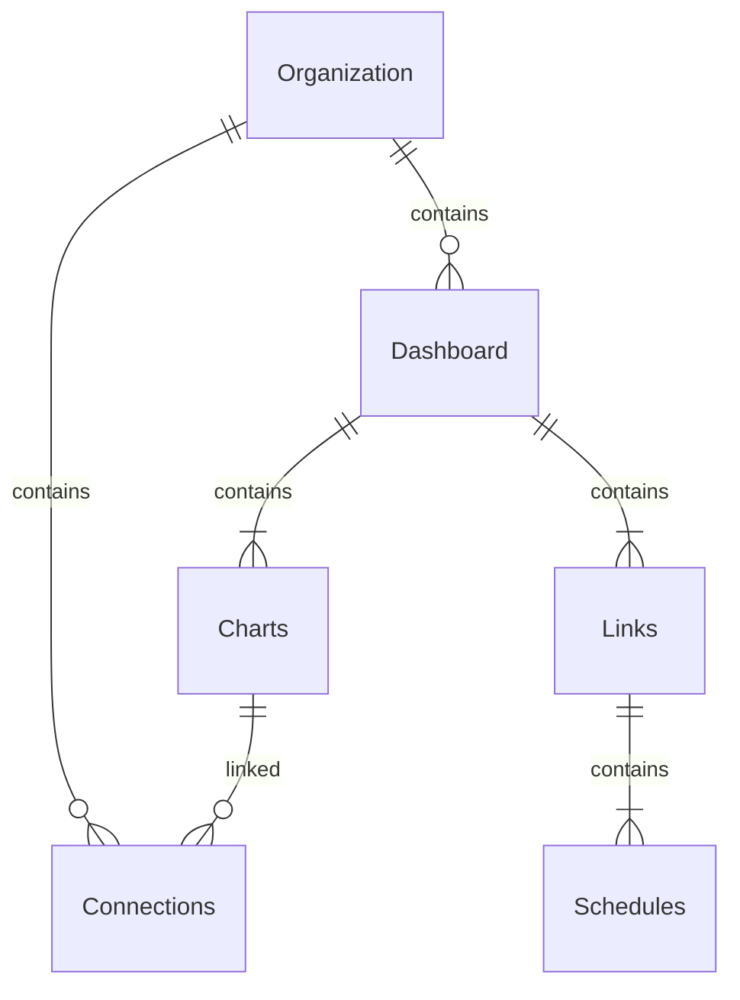

# Introduction

Sumboard is a web analytics platform that enables users to create and customize dashboards from their data sources such as sql and http APIs.

> Simplified app structure

```mermaid
erDiagram
    Organization ||--o{ Dashboard : contains
    Organization ||--o{ Connections : contains
    Dashboard ||--|{ Charts : contains
    Dashboard ||--|{ Links : contains
    Links ||--|{ Schedules : contains
    Charts ||--o{ Connections : linked
```