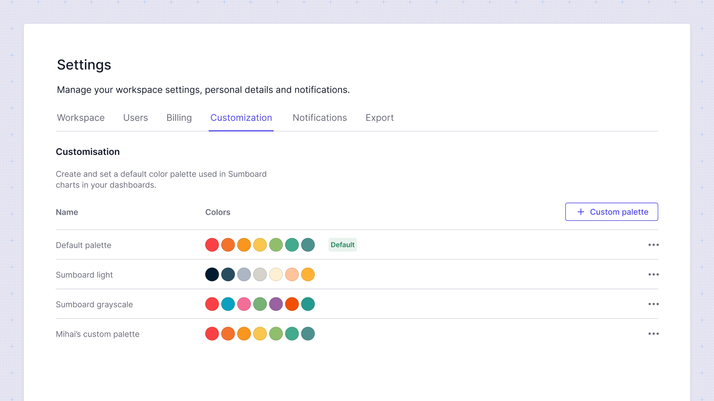
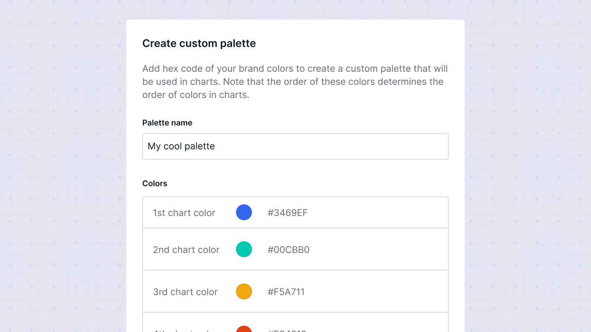

# Dashboard themes
In the Customization section, you can tailor the appearance of your dashboards to match your brand or preferred style. Sumboard offers predefined themes as well as the option to create custom themes.

## Creating a custom theme
To create a custom theme:
1. Add a theme name: Enter a descriptive name for your custom theme.
2. Hex codes for colors: Provide the hex codes for the colors you wish to use. These colors will be applied in visualizations in the order you specify. For example, in a bar or pie chart with multiple values, the first value will use the first color, the second value will use the second color, and so on.

## Apply themes to charts
Once your custom theme is created, you can apply it from the workspace settings by clicking on **Set default** to apply this theme to all dashboards by default.

You also can override default theme in Dashboard Settings sidebar. To do so:
1. Open the desired dashboard.
2. Click on the settings sidebar.
3. Choose the theme from the Theme dropdown to override the workspace default for this particular dashboard.
