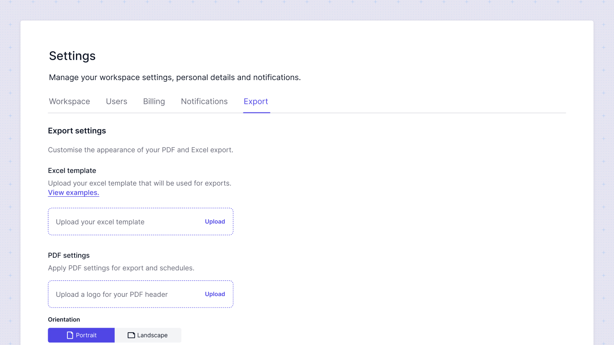
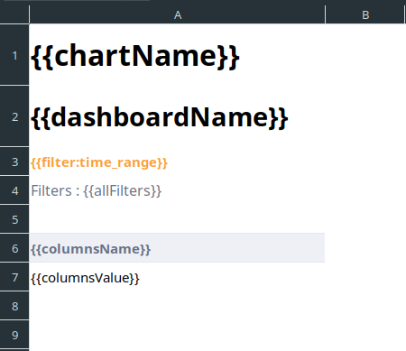

# Export settings
Sumboard allows the configuration of custom templates for emails, Excel, and PDF files to personalize the appearance of your reports. These templates are uploaded at the workspace level.



## Email templates

Emails consist of a body and a footer. The footer will always contain an unsubscribe link. The body is a simple HTML that can be customized. To include messages saved in a schedule, you need to set the `body` variable.

## Excel templates

To create an Excel template, upload an Excel file with one worksheet. In this worksheet, you can define styles for cells and images that will be duplicated on every worksheet. There are a set of variables that will be replaced with corresponding values during Excel generation:
```
- {{dashboardName}} - This will be the same on each worksheet.
- {{chartName}} - This will correspond to the chart name on the respective worksheet.
- {{columnsName}} - This marks the starting point of columns, which will expand to the right and down if there are nested columns. All cells will inherit styles from the starting cell.
- {{columnsValue}} -  This marks the starting point of chart values, which will expand to the right and down, with all cells inheriting the style of the starting cell.
- {{filterCount}} - The number of applied filters.
- {{generatedDate}} - The generation date of the file.
- {{allFilters}} - Filter values separated by commas.
- {{filters.*}} - Replace `*` with the actual filter key to apply the corresponding filter value.
```

Here's an example of an Excel template:



## PDF configuration

For PDFs, you can configure the logo source, page size, orientation, and font size of your reports.