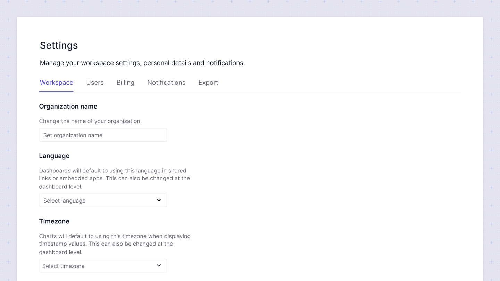

# Workspace settings
Workspace settings allow you to set up default settings that will apply to your dashboards.

Here's what you can control at the dashboard level:

**Organization Name**:
You can change the name of your organization. This name is not publicly displayed and serve only for identification purposes only.

**Language**:
Set the default language for your dashboards. This language will be used in shared links or embedded apps by default. You can also override this setting at the individual dashboard level.

**Timezone**:
Specify the default timezone for your charts. This timezone will be used when displaying timestamp values. Like the language setting, this can also be changed at the dashboard level.

**Date and Time Formats**:
**Define the default formats for displaying date and time values in your charts. These formats ensure consistency in how date and time information is presented across all charts. You can override these settings at the chart level if needed.

**Other Settings**:
Set default options for how number and currency data types are displayed in your charts. These settings can be customized at the chart level to meet specific needs.

**Secret Key**:
Your Sumboard secret key is crucial for embedding your dashboards securely.

:::warning
Treat your secret key like a password. Anyone who has access to your key will be able to embed your dashboards. Do not share your key on GitHub or any other public platform. For more information on how to protect your key, please refer to the documentation.
:::