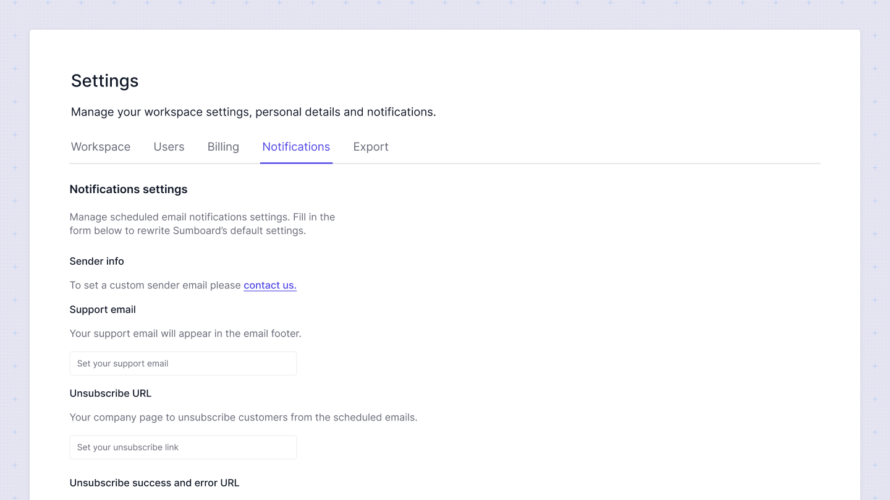

# Configure email sender
In the Notification Settings section, you can manage and customize the email notifications sent through Sumboard. Fill in the form below to overwrite Sumboard’s default settings with your preferred configurations.

## Modify sender info

By default, all emails are sent from no-reply@sumboard.io. You can configure a custom sender email address by contacting Sumboard's support. Additionally, you will need to authenticate your DNS. For more information on DNS authentication, please refer to [SendGrid's documentation](https://docs.sendgrid.com/ui/sending-email/senders).

## Support Email

Add a support email that will appear in the footer of every email notification. This ensures that your recipients can easily reach out for assistance if needed. Simply fill in the designated field with your support email address.

## Unsubscribe Page

Set your company’s page where customers can unsubscribe from scheduled emails.