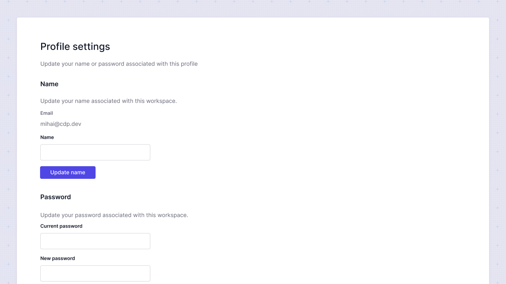

# Profile settings

In the profile settings, you can update your personal information, such as your name and password, to keep your account secure and up-to-date.

* Change your display name as it appears in your organization.
* Update your password to maintain the security of your account.