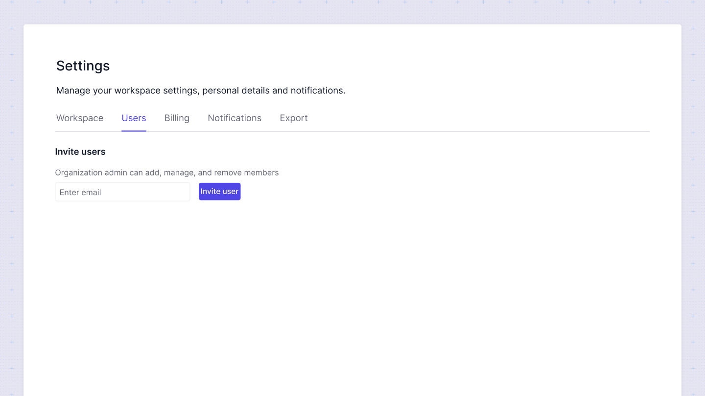

# Users
In this section, you can invite users to join your organization on Sumboard. There are two distinct roles available: Admin and Editor.

## Admin
Admins have full access to all features within the organization. They can:
* Remove other users
* Manage billing
* Access and modify all settings and configurations

## Editor
Editors have limited access compared to Admins. They can:
* Create, edit, and view dashboards
* They do not have access to billing features and cannot remove other users

## Inviting Users
To invite users to your organization:
1. Navigate to the **Users** section.
2. Enter the email address of the user you wish to invite.
3. Click on the Invite User button.

The invited user will receive an email with instructions to join your organization on Sumboard.