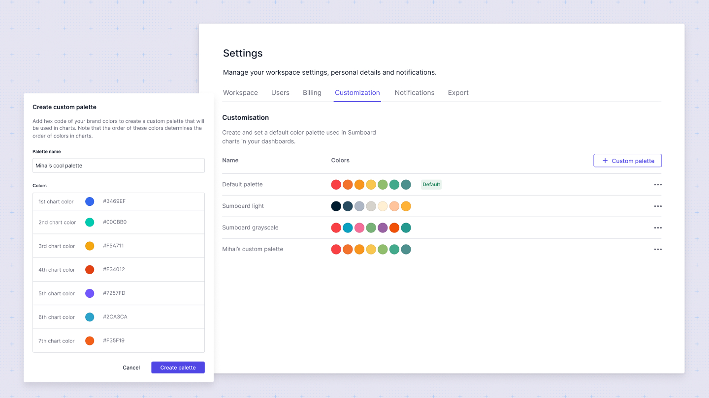

# Changelog

## June 10, 2024 - Workspace settings

We are excited to announce a major release packed with new features and improvements for our editor. This update marks the completion of our workspace settings and introduces theming improvements. Here’s a detailed look at what’s new:

### Workspace and Profile Settings
Workspace settings now allow customization of the organization name, default language, time zone, date/time formats, currency, and precision. You can also generate a new secret key directly from the workspace.

### User Management
Users can now invite and manage other users.

### Billing
Manage subscriptions and packages within the billing section.

### Customization
Create and apply custom color palettes to dashboards, allowing for brand-specific theming.

### Notifications
Customize support emails and links in scheduled emails directly from the workspace.

### Export Settings
Export settings now support custom Excel templates, PDF settings, and export format adjustments.

### Profile Settings
View and update your email, name, and password.

### A couple of words about what's next in Sumboard
We are excited to share that enhanced PDF layout customization and versioning are on the horizon. Customers have requested more control over PDF layouts to create custom schedules and reports. Versioning will allow you to replicate workflows with separate data sources per environment and the ability to publish new versions. Go create some dashboards and share your thoughts with us. 