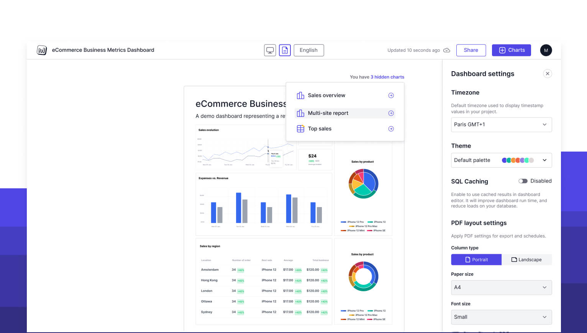

# Changelog

## July 3, 2024 - PDF layout builder

We're excited to announce our latest release, packed with powerful new features to enhance your customer-facing analytics experience!

### 🎉 New Feature: PDF Layout Builder

We're thrilled to introduce our most requested feature: the PDF Layout Builder. This powerful tool allows you to customize how your PDFs look, giving you full control over your exported analytics.

#### How it works:
- Access the PDF layout switcher in the navbar
- Customize PDF page size, font size, and filter display in the settings sidebar
- Drag and drop charts to arrange your perfect PDF layout
- Hide or show charts specifically for PDF exports

This feature ensures your exported PDFs look exactly how you want them, focusing on the most important data for your customers.

### 🚀 Other Exciting Updates

1. **Improved Onboarding**: We've added a small onboarding process to help new users understand how to use Sumboard effectively.

2. **Default Data Source**: You can now set a default data source at the organization level, making it even easier to create charts.

3. **Filter Indicator**: Charts now display the number of applied filters, giving you a better dashboard editor experience.

4. **UI Enhancements**: We've added new move and remove chart buttons.

### 🔮 Coming Soon: Versioning

We're excited to announce that versioning is on the horizon! This feature will allow you to:
- Replicate workflows with separate data sources per environment
- Publish new versions of your dashboards!

---

We can't wait to see what you create with these new tools. Go ahead, build some amazing dashboards, and let us know what you think!

As always, your feedback is crucial in shaping Sumboard's future. If you have any thoughts or suggestions, please don't hesitate to reach out.

Happy dashboarding!

## June 10, 2024 - Workspace settings

We are excited to announce a major release packed with new features and improvements for our editor. This update marks the completion of our workspace settings and introduces theming improvements. Here’s a detailed look at what’s new:

### Workspace and Profile Settings
Workspace settings now allow customization of the organization name, default language, time zone, date/time formats, currency, and precision. You can also generate a new secret key directly from the workspace.

### User Management
Users can now invite and manage other users.

### Billing
Manage subscriptions and packages within the billing section.

### Customization
Create and apply custom color palettes to dashboards, allowing for brand-specific theming.

### Notifications
Customize support emails and links in scheduled emails directly from the workspace.

### Export Settings
Export settings now support custom Excel templates, PDF settings, and export format adjustments.

### Profile Settings
View and update your email, name, and password.

### A couple of words about what's next in Sumboard
We are excited to share that enhanced PDF layout customization and versioning are on the horizon. Customers have requested more control over PDF layouts to create custom schedules and reports. Versioning will allow you to replicate workflows with separate data sources per environment and the ability to publish new versions. Go create some dashboards and share your thoughts with us. 