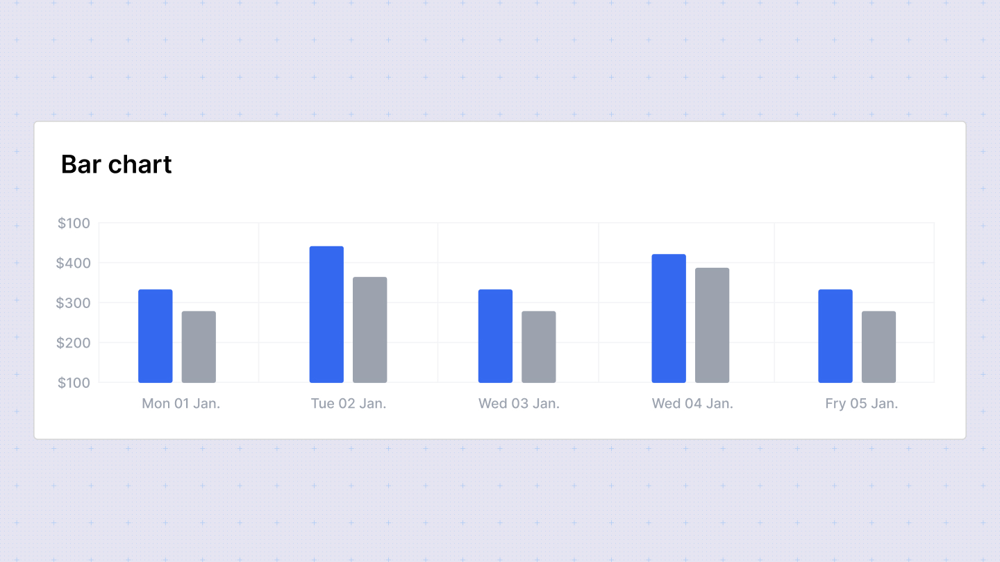

# Bar Chart

Bar charts are ideal for visually comparing data across different categories. They use rectangular bars where the length of each bar corresponds to the data being represented.

## Configuration Options

In the configuration sidebar, you can customize the bar chart with the following options:

- **Chart type**: Switch between different chart types to visualize your data. Sumboard will map the columns based on its best guess to build the visualization.
- **Chart title**: Add or disable the chart title to provide context to your data.
- **X-axis**: Select the column to display on the x-axis. You can enable multiple columns for comparison.
- **Y-axis**: Choose the column for the y-axis. Only one column is allowed for the y-axis.
- **Column titles**: Customize the titles of the columns displayed on the chart.
- **Column type**: Choose from **Date/time**, **number**, **currency**, **percent**, or **string** for each column.

### Column type options

- **Number**: Define the number of decimal places to display.
- **Currency**: Specify the currency placeholder (default is set in workspace settings).
- **Duration**: Select the style for displaying duration: Narrow, Short, or Long. Duration types are used for displaying specific durations (e.g., 3 seconds).

## Grouped Bar Chart
The grouped bar chart variation allows you to select both row and column dimensions instead of traditional x and y-axis settings. This flexibility enables you to compare data across multiple categories within each group.