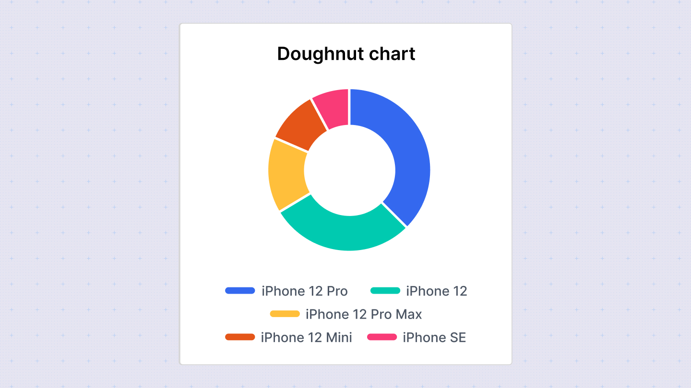

# Doughnut Chart

Doughnut charts are similar to pie charts but include a hole in the center, making them visually distinctive. Like pie charts, they are effective for displaying proportions of a whole where each segment represents a category's contribution to the total.

## Configuration Options

Customize the doughnut chart using the following options in the configuration sidebar:

- **Chart type**: Switch between different chart types to visualize your data. Sumboard will map the columns based on its best guess.
- **Chart title**: Add or disable the chart title to provide context to your data.
- **Value**: Select the column containing the values for each segment of the doughnut chart.
- **Label**: Choose the column that provides labels for each segment.

## Column Type Options

- **Number**: Define the number of decimal places to display.
- **Currency**: Specify the currency placeholder (default is set in workspace settings).
- **String**: Display labels as text.