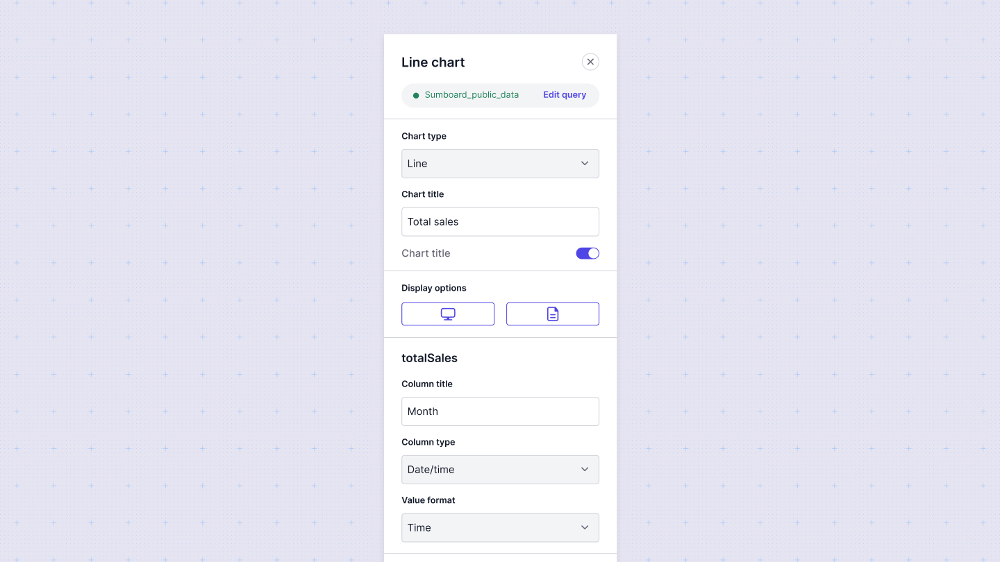

# Introduction

Sumboard charts offer a variety of configuration options to customize the look and behavior of your visualizations.

A chart is an individual unit of data representation within a dashboard that performs a query on a configured data source. These queries can be SQL, No-SQL, or API requests. A dashboard is built from multiple charts and can draw from multiple data sources.

For each chart, you can apply filters through the query editor, tailoring the data displayed to meet specific criteria. All chart configurations are managed from the sidebar config.



## Configuring a chart
1. **Add a chart**: Select the chart type you'd like to use for your visualization.
2. **Write a query**: Extract data by writing a query.
3. **Map columns**: In the configuration panel, map the columns in your datasets to the axes of your chart. Sumboard automatically chooses columns based on the chart type you select, but these values can be changed.

## General chart settings
These settings are available for all chart types:

* Title: Set the title of the chart to give context to your data.
* Data Source: Select the data source that the chart will visualize.
* Filters: Apply filters to narrow down the data displayed in the chart.

## Changing a column's data type
Columns in a chart will render as one of three data types: 
* string 
* number
* datetime. 

These data types impact how the data is rendered in the chart. To ensure your chart renders correctly, you may need to override a column's datatype by selecting the appropriate value from the **Column type** select.

## Adding data labels
For some charts, you can add a custom label in the **Column title**.

## Examples of queries

**SQL query example**

```sql
SELECT
    {t.created_at:aggregation} AS period,
    COUNT(*) as nrOrders,
    sum(t.amount) / 100 as totalAmount
FROM
    orders
    INNER JOIN applications a on a.id = orders.application_id
    INNER JOIN transactions t on t.order_id = orders.id
WHERE
    { t.created_at :time_range }
GROUP BY 1 ORDER BY 1 LIMIT 5000;
```

**API query example**

```url
https://example-api/v1/analytics/{:tokenFilter}/sales?{aggregation:aggregation}&{time_range:time_range}
```
:::info
Note that you can't set placeholders for filters that doesn't exists in dashboards
:::

**API response should have one of the following structure**

```json
[
  [
    {
      "field1": "value1",
      "field2": "value2"
    }
  ]
]
```

**or**

```json
{
    "items": [
        [
            {
                "field1": "value1",
                "field2": "value2"
            }
        ]
    ],
    "filters"?: {
        "filter1": "filterLabel1",
        "filter2": "filterLabel2"
    }
}
```
## Chart types
A chart can be one of the following types:

* [Bar](/charts/bar/)
* [Line](/charts/line/)
* [Pie](/charts/pie/)
* [Doughnut](/charts/doughnut/)
* [Text](/charts/text/)
* [Number](/charts/number/)
* [Table](/charts/table/)
* [Transpose table](/charts/table-transpose/)
* [Pivot table](/charts/table-pivot/)
