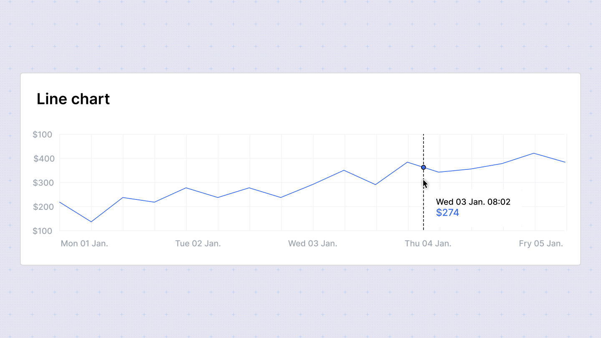

# Line Chart

Line charts are effective for displaying trends over time. They use lines to connect data points on a two-dimensional plane, with each point representing a value for a given category or time period.

## Configuration Options

In the configuration sidebar, customize the line chart with the following options:

- **Chart type**: Switch between different chart types to visualize your data. Sumboard will map the columns based on its best guess.
- **Chart title**: Add or disable the chart title to provide context to your data.
- **X-axis**: Select the column to display on the x-axis. You can enable a single column for x-axis.
- **Y-axis**: Choose the column for the y-axis. Multiple columns are allowed for the y-axis.
- **Column titles**: Customize the titles of the columns displayed on the chart.
- **Column type**: Choose from **Date/time**, **number**, **currency**, **percent**, or **string** for each column.

### Column type options

- **Number**: Define the number of decimal places to display.
- **Currency**: Specify the currency placeholder (default is set in workspace settings).
- **Duration**: Select the style for displaying duration: Narrow, Short, or Long. Duration types are used for displaying specific durations (e.g., 3 seconds).

## Grouped line chart

The grouped line chart allows you to organize data into groups and compare values across these groups using lines. It shares the same configuration settings as the grouped bar chart, where you can select rows and columns instead of x and y axes for comparison.