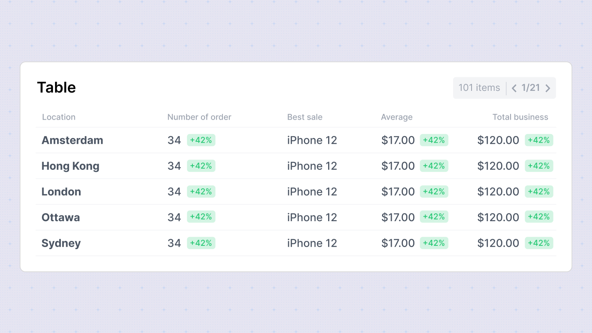

**Table Chart**

The Table Chart in Sumboard provides a structured way to display tabular data, making it useful for presenting detailed information and comparisons within your dashboard.

In the configuration sidebar, you can customize the following options:
- **Chart title**: Add or disable the chart title for clarity.
- **Columns**: Choose which columns to display from your dataset. You can reorder them as needed.
- **Column settings**: Customize each column's title and data type (Date/time, number, currency, percent, string, duration).
- **Column alignment**: Align columns to the left, center, or right for better readability.
- **Grouping**: Group columns under a parent to organize data hierarchically.
- **Calculate totals**: Enable to calculate totals for numeric columns, providing summary insights directly within the table.

### Column type options
- **Number**: Specify the number of decimal places to display.
- **Currency**: Define the currency placeholder (default is from workspace settings).
- **Duration**: Choose the duration style: Narrow, Short, or Long, for displaying specific time durations (e.g., "3 seconds").