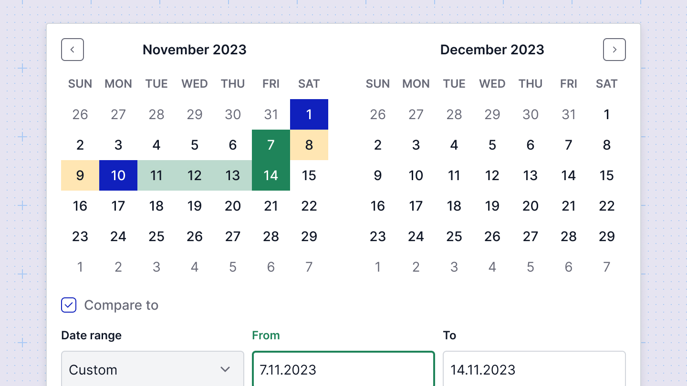

# Compare feature
The compare feature is available in the **Time range** filter view. Users can click on the Compare to checkbox and select either a relative or absolute time range for comparison. 

Once the comparison period is selected, the interface will display the comparison values directly in the charts, providing a clear and insightful visual representation of how the data has changed over time.

