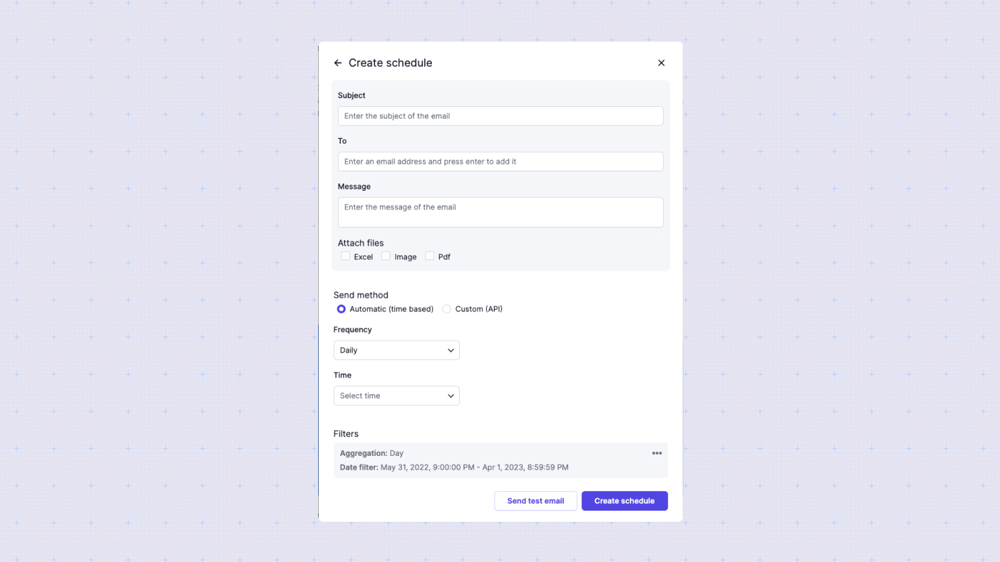

# Customer-facing features
Sumboard offers a suite of customer-facing features designed to enhance user experience and provide valuable insights through interactive and customizable dashboards. 

## Interactivity
Interactivity in Sumboard enables users to actively engage with the data presented in dashboards. Users can hover over data points for more details or use the compare feature to analyze data against a preceding period.

## Filtering
Filtering is a key feature that enables users to refine the data displayed in dashboards based on specific criteria. Filters can be applied dynamically, allowing users to focus on particular date ranges, data values, or custom conditions, providing a more tailored view of the data.

## Scheduling
The scheduling feature allows users to set up regular email reports and updates. By configuring schedules, users can receive up-to-date data and insights directly in their inboxes at specified intervals, in PDF or Excel format, ensuring they stay informed without needing to manually check the dashboards.

## Exporting
Sumboard provides exporting capabilities, allowing users to export dashboards and data into formats such as PDF, or Excel. This feature is essential for offline analysis, reporting, and sharing insights with others outside the platform.