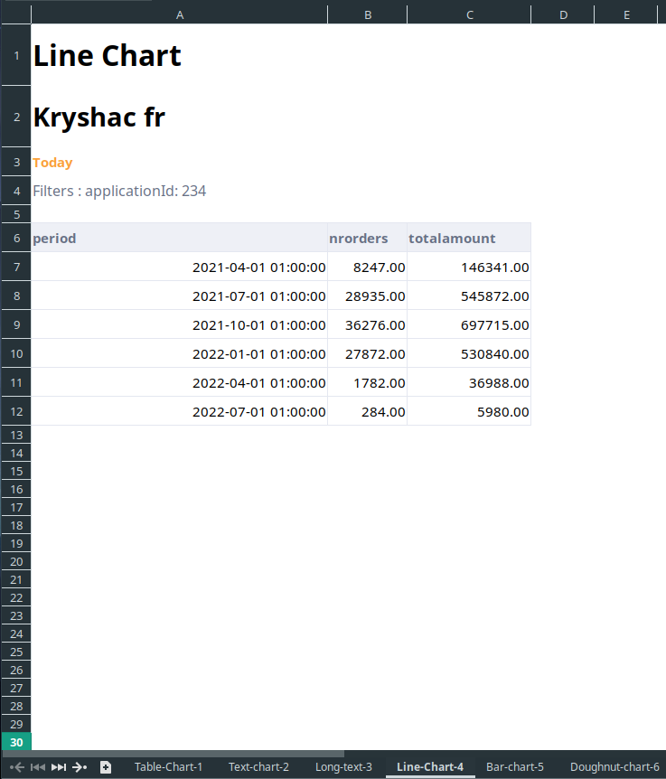
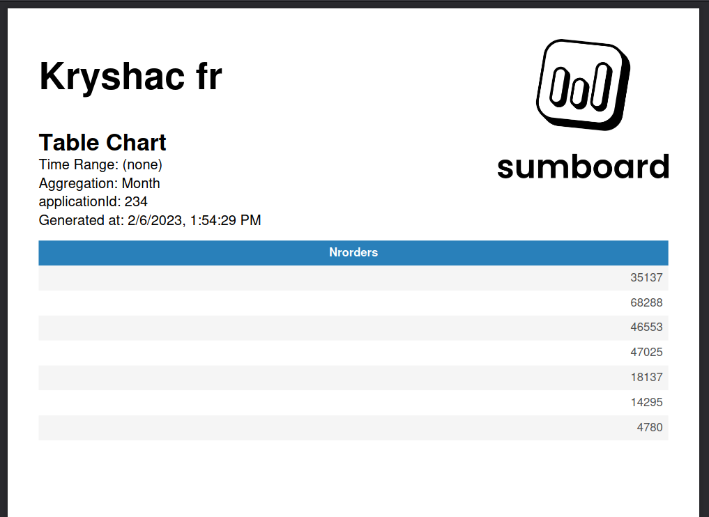
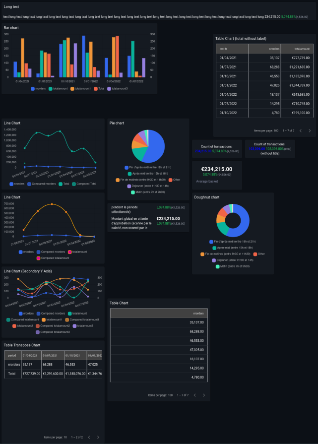

# Reports
Reports are documents generated based on your dashboards, which can be downloaded directly or sent via email using [Schedules](/customer-facing/schedules/). Sumboard offers three types of reports:
* Excel
* PDF
* Image

## Excel
When creating an Excel report from a dashboard, each chart is exported to its own worksheet, named after the chart. The file name will include the dashboard name and the generation time. By default, the Excel report will not include images but will list the applied filters and the generation date.

## PDF
By default it will show dashboard name and sumboard logo only on the first page. Chart name, applied filters and generation date on each page. 

## Image
In case of image, it will take a screenshot of the entire dashboard or an individual chart.

:::info
Both PDF and Excel reports can be customized in [Workspace settings](/settings/) to align with your brand guidelines and specific requirements.
:::