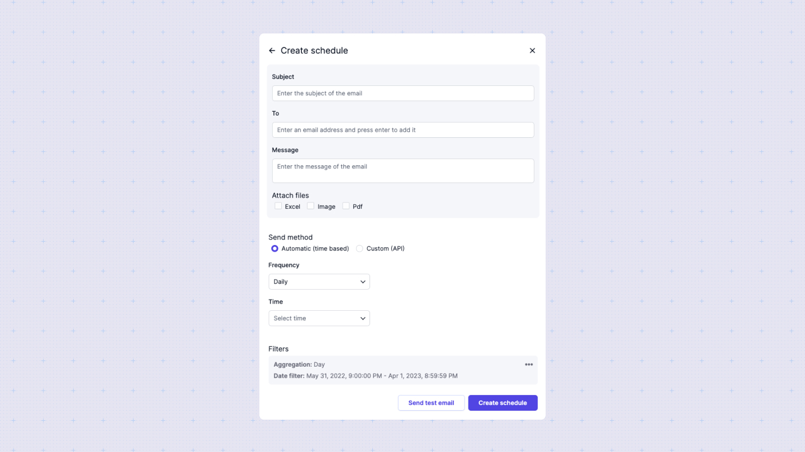

# Schedules
You and your customers can schedule email notifications to be sent at hourly, daily, weekly, or monthly intervals.

:::info
To use this feature, ensure that `Allow schedules` is turned on for the embedding or shared link you are using.
:::

When creating a schedule, the dashboard export (as Excel, PDF, or Image) will be sent to the specified emails, along with a custom message and subject, at the selected day and hour. Multiple schedules can be created for a given dashboard, each with its own unique settings.

## Creating a schedule
To view and configure schedules, click the three dots in the top-right corner of the dashboard and select the Schedules option. A popup will appear displaying the currently active schedules. You can also delete schedules from this list.

:::info
Each user with a different token will have unique schedules.
:::

To create a schedule, you need to specify the following options:
- **Send to**: A list of email addresses that will receive the report (minimum one address).
- **Subject**: The subject of the email.
- **Message**: The body of the email. You can include variables such as specific filter values, dashboard name, and filter count.
- **Format**: The types of reports to attach to the email. Available formats are **Excel**, **PDF**, and **Image** (minimum one attachment required).
- **Type**: A radio button to choose between Time-based (automatic) or Custom trigger scheduling.

If the type is **Custom Trigger**, a trigger URL will be generated that can be activated through a POST request with an organization token. If the type is **Time-based**, additional configuration is required.

You can choose from four time-based orientations:
- **Day**: Configure the interval between days when the email will be sent.
- **Week**: Configure the interval between weeks and the specific day of the week. 
- **Month**: Set the interval between months and specify either specific month days or relative days (e.g., last day of the month).
- **Year**: Set the interval between years, specify the months, and the days within those months, or use relative dates.

For all four cases, you need to specify the exact time when the email will be sent.
:::info
The emial will always include a link to unsubscribe from the schedule. By default it will be a Sumboard link, but you can configure a custom one from [Notification settings](/administration/notifications/)
:::

