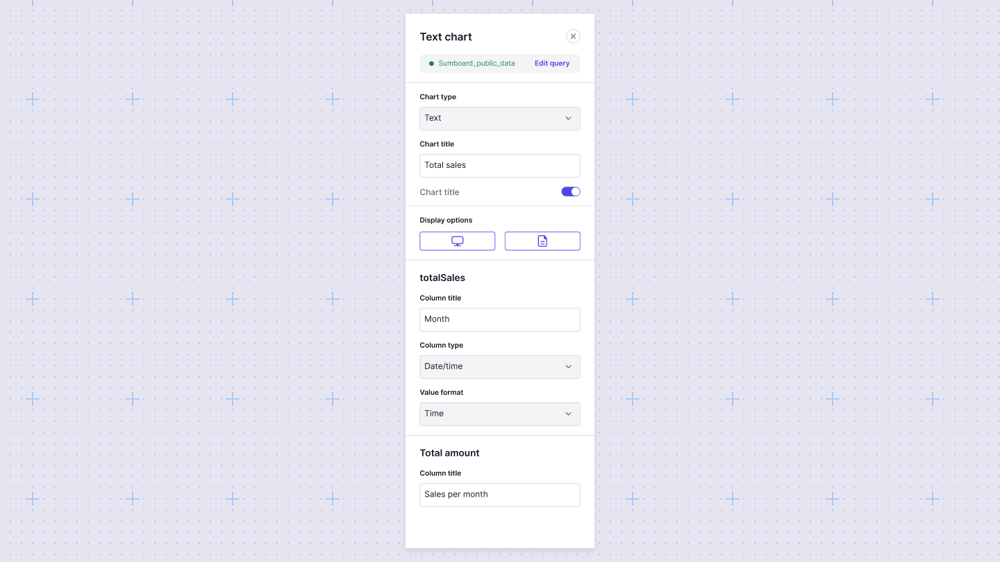
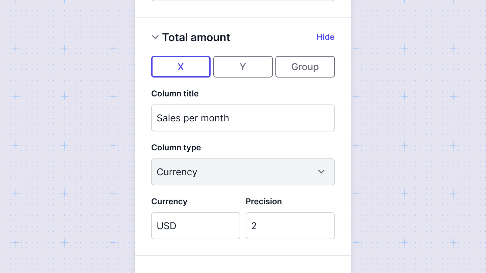
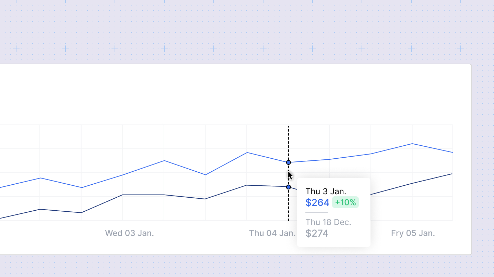

# Chart configurations
In Sumboard, each chart type comes with its own set of configurable options, allowing you to customize the appearance and behavior of your charts.

The chart configurations will be available in the configurations sidebar:

## Configuring a chart
1. Add a chart you'd like to use for your visualization.
2. Write a query to extract data.
3. Map the columns in your datasets to the axes of your chart in the configuration panel. Note that Sumboard automatically choose columns based on the chart type you choose, but the values can be changed. 

## General chart settings
These settings are available for all chart types:

- **Title**: Set the title of the chart to give context to your data.
- **Data source**: Select the data source that the chart will visualize.
- **Filters**: Apply filters to narrow down the data displayed in the chart.

## Change a column's data type
Columns in a chart will render as one of three data types: `string`, `number`, and `datetime`. These datatypes impact how the data is rendered in the chart. Sometimes, you may need to override a column's datatype to ensure your chart renders correctly. You can do this by selecting the proper value from the `Column type` select.

## Adding data labels
For some charts you can add a custom label in the `Column title`. 

## Interactive charts
All Sumboard charts are interactive both in the Editor and in the viewer mode.
- Hovering over a data point will highlight the underlying data
- Clicking on a legend item will enable/disable the specific data

## Chart colors
Sumboard charts support different color themes. You can add a color theme in the **Customization** tab from the **Workspace settings**. Then you can apply a **theme** from the **Dashboard settings**

## Chart timezones
If one or both of your chart axes uses a timestamp column, Sumboard will convert timestamps to a target timezone.The target timezone is set by the workspace timezone, and can be overriden on the Dashboard level from **Dashboard settings**. 