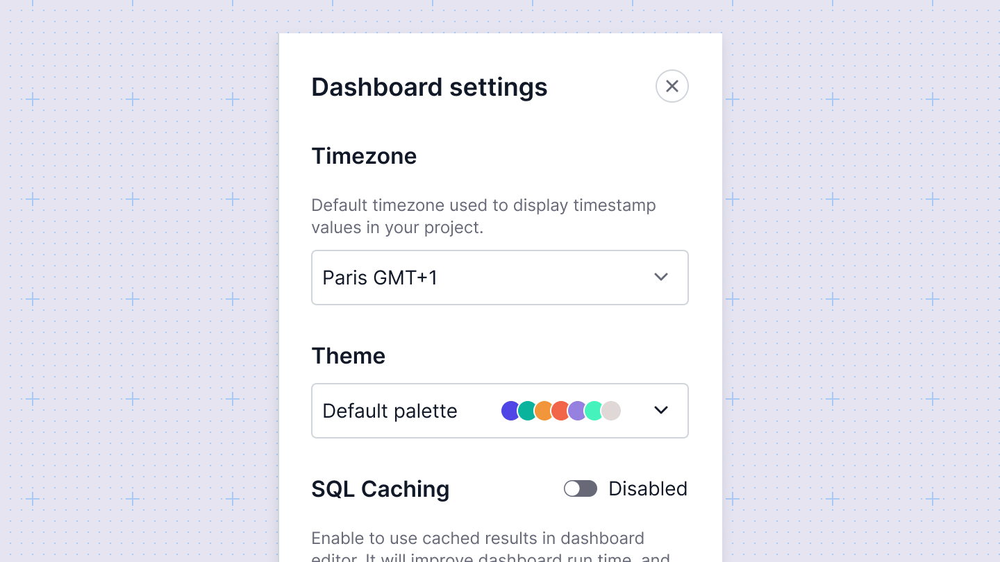

# Dashboard settings
The dashboard settings in Sumboard allow you to configure both visual components and localization aspects. Here’s a breakdown of what you can adjust:
* **Timezone**: Set the timezone for the dashboard to ensure all time-related data is displayed correctly according to your specified timezone.
* **Theme**: Customize the visual theme of your dashboard.
* **Caching**: Configure caching settings to optimize performance. Caching can improve load times by storing frequently accessed data.

