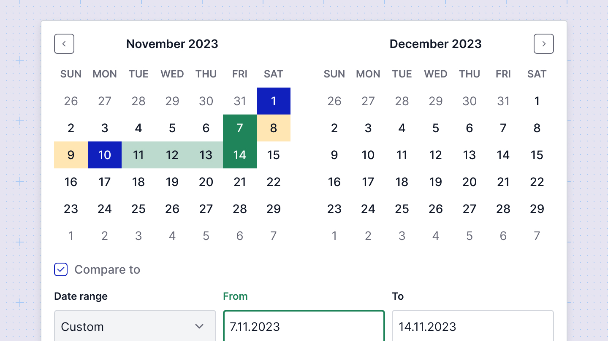

# Filters

You can apply filters to any chart, enabling your customers to interact with and explore the data. Filters can be based on various criteria, such as date ranges, specific data values, or custom conditions, allowing for a more tailored and interactive data experience.

## Applying filters
To apply apply a filter to a chart follow this [refference](/dashboard-editor/query-editor/#applying-filters). 

## Filter types
Sumboard supports the following filter types to enhance data interactivity:
* **Time range** - This filter allows users to specify a date range and compare data between two different time periods.
* **Aggregation** - Aggregates data values based on selected intervals such as daily, weekly, monthly, or yearly, providing a summarized view of the data.
* **Custom** - User-created filters that appear in the top bar as a selectable UI element. These filters derive their values from the queries you set up, offering tailored filtering options.
* **External** - Filters that do not fit into the above categories. You control the UI and the values, but in Sumboard, they will appear as a simple input field for string values.

## Filter label
The display name for the filter, shown instead of the raw filter label. You can specify this name when creating the filter or at the dashboard level.