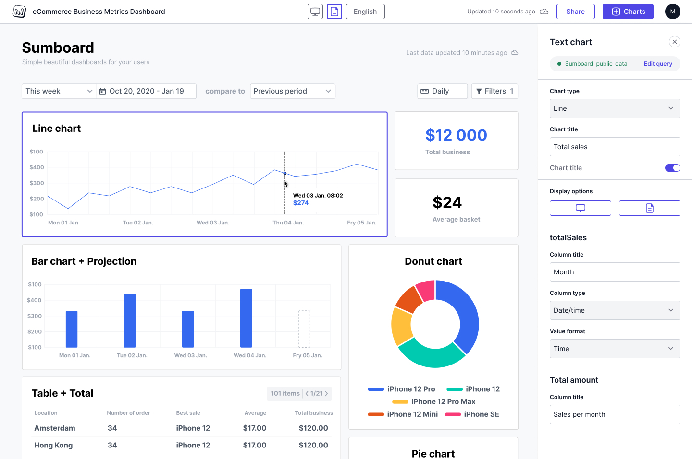
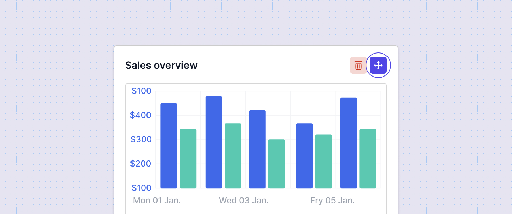
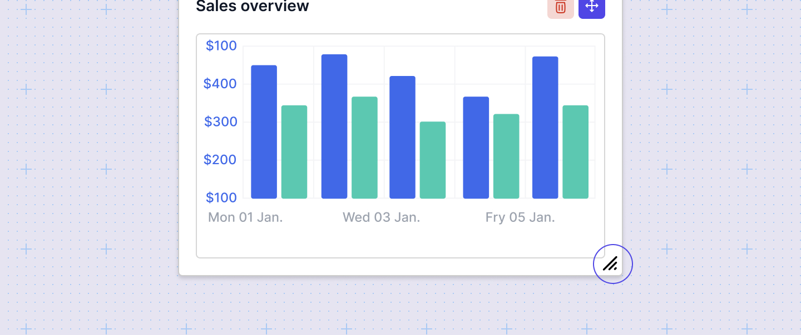

# Introduction
Dashboard editor lets you create interactive data dashboards, tailored for both internal or user-facing data needs. 

## What is the dashboard editor?
The Dashboard Editor serves as a workspace where you can visualize and work with your raw data. With its intuitive drag-and-drop functionality, you can arrange charts, write data queries, and refine chart configurations. In Sumboard's editor, you can also apply filters for precise analysis, localize content for diverse audiences, and share your dashboards with your team or customers.

Sumboard offers the following chart types to build your dashboard:
- Text (custom HTML)
- Number
- Bar
- Line
- Pie / Doughnut
- Table
- Pivot table

:::info
We're continuously updating our list of available charts. If there's a chart you'd like us to prioritize, please let us know at support@sumboard.io.
:::

Each chart has its own configuration options.

The final dashboard can be shared via a link or seamlessly embedded in an external application. 

## Arrange and format charts in your dashboard
The first time you create a dashboard it's empty. You should add charts and query data to start building your dashboard. You can add, remove, reposition and resize charts and filters elements to customize tha layout of your dashboard. 

### Dragging
You can drag charts to rows and columns.

### Resizing
You can adjust the size of elements by clicking and dragging from the left, bottom or right side of a chart:

