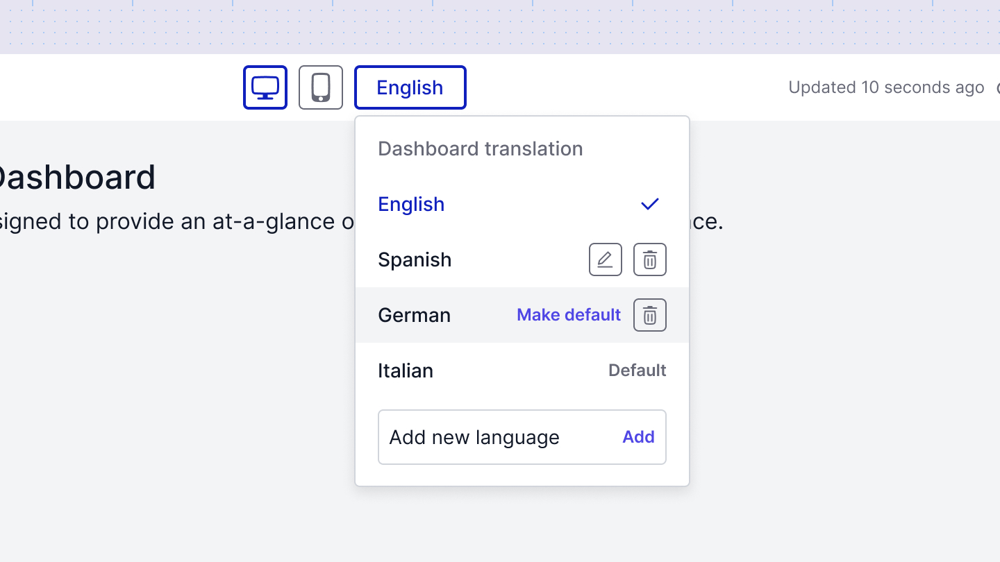

# Localization
To make your dashboards accessible to a global audience, you can localize content such as titles, descriptions, and data labels into different languages.

## Adding a translation
* Select a new language from the available list.
* The dashboard will create a duplicate version for the new language.
* You can then translate all titles, descriptions, and labels of the charts in this duplicate dashboard.