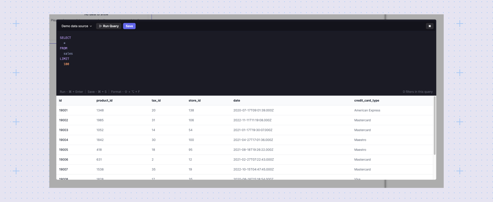
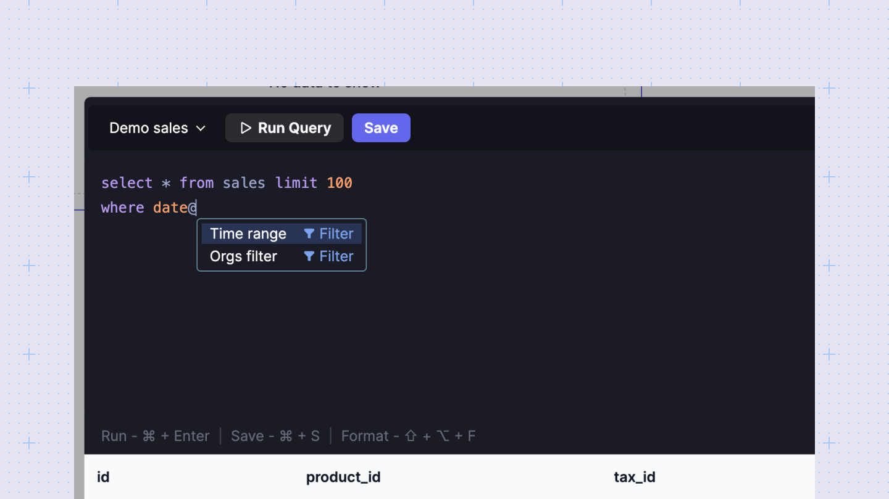

# Query editor
Sumboard's query editor allows you to analyze your data from various sources, including SQL databases, NoSQL databases, and APIs.



## Executing queries
The results table offers a preview of your data, showcasing up to the first 10 rows.

In editor, you can:
- Run the query (cmd+enter) to see the results.
- Format the query using cmd+f hotkey.
- Save (cmd+s) the query if you're satisfied with the results and it will apply the data to the chart.

:::warning
Warning: Executing an uncached SQL query directly interacts with your database. To optimize performance and avoid unnecessary database calls, consider enabling caching.
:::

## Applying filters


Filters allow you to refine your data view and create interactive dashboards. Here's how to apply filters in your queries:
1. Use the `@` hotkey within the query editor to reveal a list of filter keys available to your organization.
2. Choose the filter key relevant to the specific chart you're creating.

Here's an example where we apply a `time_range` filter:
```sql
SELECT
  created_at
FROM
  users 
WHERE {created_at:time_range}
```

In this example, `WHERE {created_at:time_range}` incorporates the `time_range` filter, enabling users to filter data based on the `created_at` column.

## Error handling
The query editor helps identify and display errors in your SQL requests. If a query references a column that doesn't exist in the data source, the editor will flag an error. Syntax erros also will be highlighted.