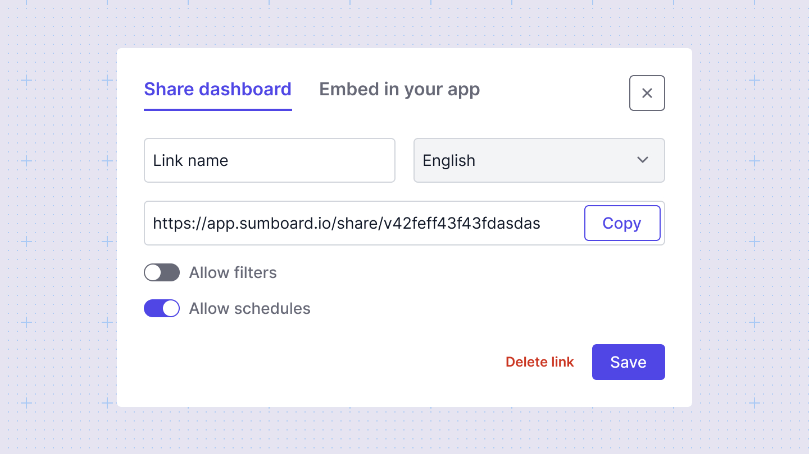
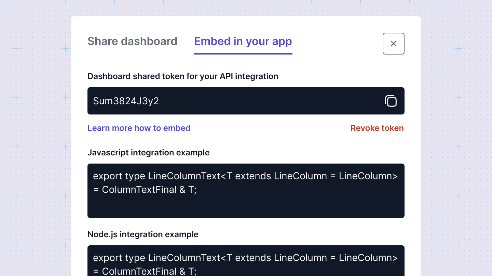

# Sharing and embedding
A dashboard can be shared via a link or embedded in an external app. 

## Sharing
To share your dashboard with others, you need to create a shared link by clicking the **Share** button. You can generate multiple links, each with specific settings. For each link, you can enable features such as email scheduling and filtering. This option generates a link to your published dashboard with all filters set to their default values. Any changes you may have made to any shared dashboard will be reflected in the shared dashboard link.

## Embedding
Embed dashboards into any website that supports iframes. To embed a dashboard, click the **Share** button, then navigate to the **Embed** tab. Here, you'll find a shared token for your integration. Use this token to embed the dashboard into your website. With this token, the dashboard will display personalized data to each user, ensuring a tailored experience.

Additionally, you can choose whether to allow your customers to schedule email notifications, use filters, or set up custom triggers for embedding.

You can find more information about embedding [here](/embedding/).