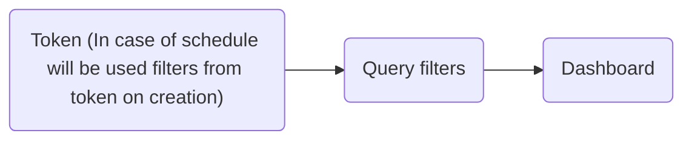

# Filters

You can specify filters in dashboard that determines what you can use in queries. Sumboard provides some hardcoded labels that have predefined values.

### Configuration

#### Type

* TimeRange - predefined filter, it can be of format `startTimeStamp~endTimeStamp` and will be treated as (from, to) pair
* Aggregation
* Select - user created filter, it will appear in top bar as a select option
* Unknown - none of above

#### Place

* Apps - filters are used within Sumboard page from top bar
* Extern - filters send externally through iframe
* Token - filters that are added to the token when the token is generated by a third party

#### Values

Default values of the filter, if number of values will be greater than 1, dashboard will enter in compare mode. It has following structure:

```json
[
    {
        "value": "default filter value",
        "label?": "filter label that will be displayed instead of raw value"
    }
]
```

#### Name (optional)
Filter name that is shown instead of raw filter label

> Note that filters can be overwritten by following hierarchy

