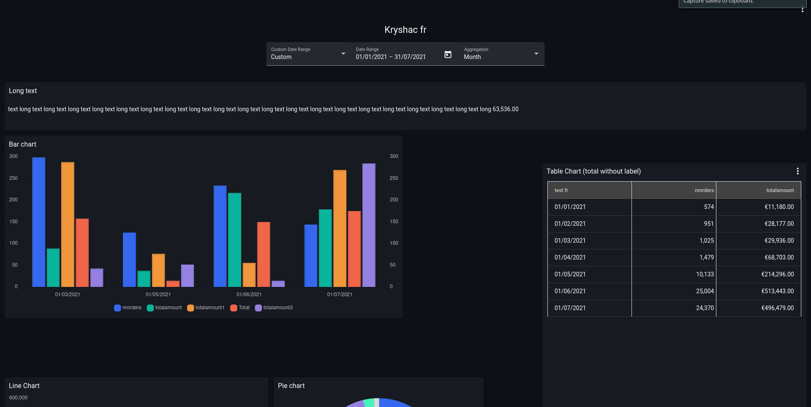

# Overview

Dashboard is where all the magic happens, the place where users will spend most of the time analyzing data. It is formed from a set of charts that can be interactively adapted by the selected filters. Dashboards can be seen from your organization only or set as public only through [links](/dashboards/links/).

#### Organization dashboards

Embedded dashboards that can be accessed only if you have a token generated with the company secret. In this scenario filters are send from host application.

#### Public dashboards

Standalone dashboards that doesn't require any additional authentication. Filters are applied from top bar
