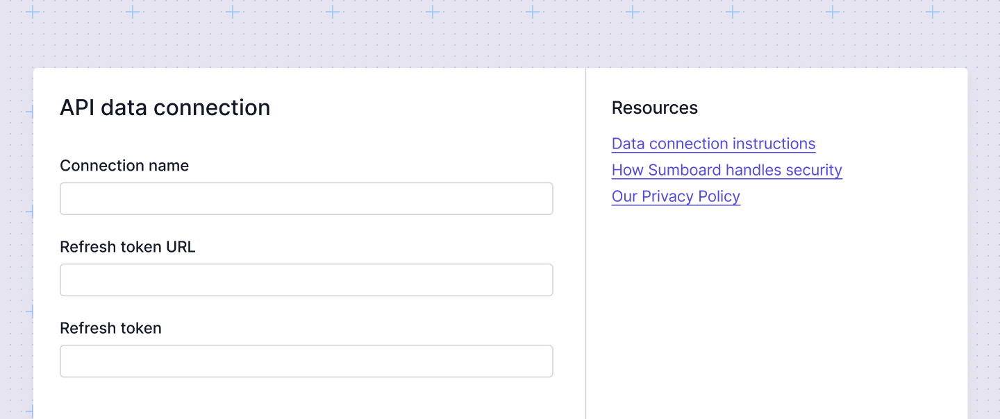

# API data source connection


To add an API connection in Sumboard, you need to provide the following details. Sumboard will generate a temporary token once the previous one expires. Please specify the following options:
- connection name
- refresh token URL
- refresh token

:::info
The refresh token will be encrypted for security.
:::

To enable Sumboard to connect to your API, you need to allow the Sumboard domain in your CORS configuration. This ensures that requests from Sumboard are permitted by your API server. Add the following domains to your CORS policy:

```
editor.sumboard.io
app.sumboard.io
```