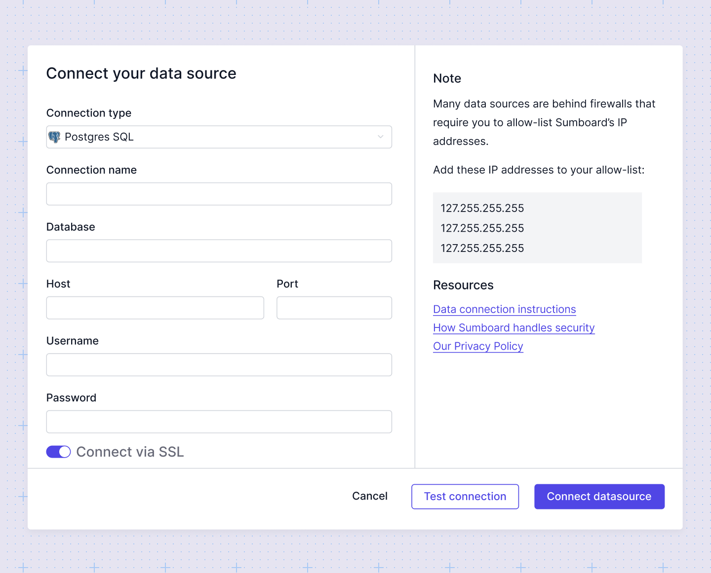

# Data connections
Sumboard makes it easy to connect to your SQL, No-SQL or API data source connection. 

## Supported data sources
Sumboard currently supports the following data sources:
- PostgreSQL
- MySQL
- MS SQL Server
- MariaDB
- MongoDB
- Rest API

:::info
We're continuously updating our list of supported data connections. If there's an integration you'd like us to prioritize, please let us know at support@sumboard.io.
:::

## Add a new connection 
:::info
Ensure you create a user with read rights for your integration.
:::

Navigate to the **Data sources** tab. 

When you click the **Add Data Source** button, you will be prompted to select a data source type and fill in the relevant connection details. Ensure that [Sumboard is allowed to connect to your data source](allow-sumboard/). 

For **PostgreSQL**, **MySQL**, **MS SQL Server** and **MariaDB** you need to specify following options:
- Database host
- Database port
- Database name
- Username & password

For **MongoDB** you need to specify following options:
- Mongo connection string to server, only host and port part
- Username & password
- Database name

:::info
All credentials are encrypted using industry-standard encryption protocols both in transit and at rest. This means your creadentials are securely stored, preventing unauthorized access.
:::
