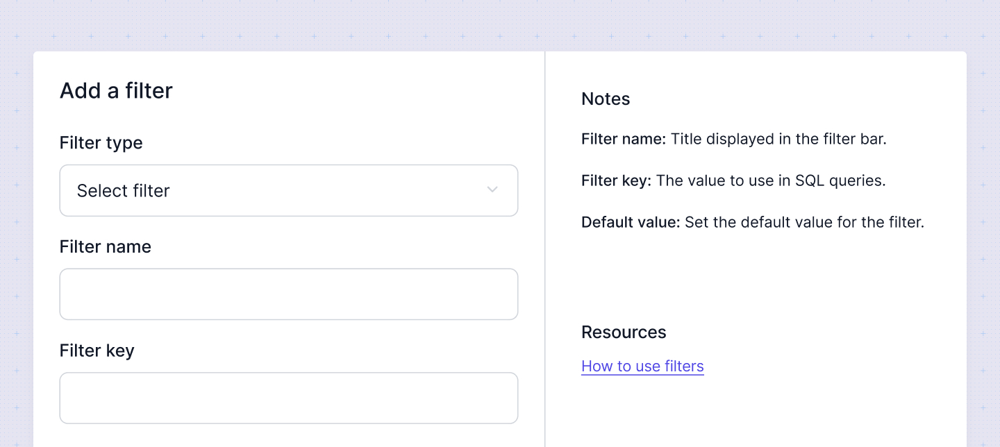

# Default filters
Default filters in Sumboard provide essential filtering capabilities that are readily available for use. These include the time range filter and aggregation filter, which help users quickly and effectively narrow down their data for more precise analysis.

* **Time Range Filter**: Allows users to filter data based on specific date ranges and compare over period.
* **Aggregation Filter**: Enables data aggregation over different periods such as daily, weekly, or monthly, providing a summarized view of the data.

## Adding a default filter
To add a default filter navigate to **Filters** section. Click on the **Add a filter** button.

In the modal that opens you have to specify:
* **Filter name**: Enter a descriptive name. It will be the filter label and it can be overriden on the dashboard level.
* **Filter type**: Choose the appropriate filter type.
* **Filter key**: Specify the filter key, which is used in the query to apply the filter to specific charts. This ensures that the aggregation filter is applied correctly to the data.
* **Default value**: Define the default values. These values determine the initial state of the filter when the dashboard is loaded. You can override the default value on the dashboard level if needed.