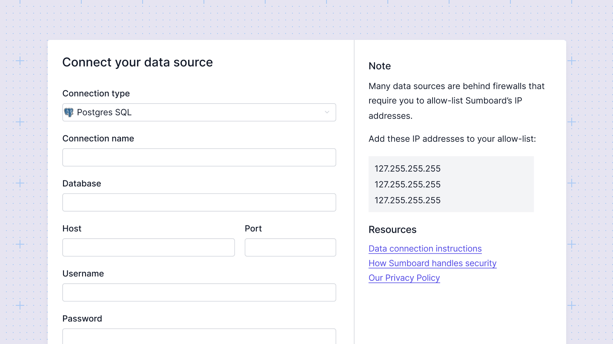

# Connect your data
Connect data from your warehouse, SQL/No-SQL databases, or API.

:::tip
Start exploring Sumboard immediately with our demo data connection, **[Demo] Sumboard public data**, pre-installed on all new workspaces. You can find it in Data Sources.
:::

There are several ways to start working with your own data in Sumboard:
1. Connect your SQL or No-SQL data source (read more [here](/data-sources/)).
2. Create an API connection and pull data into Sumboard (read more [here](/data-sources/)).

:::tip
You can combine data from multiple data sources in the same dashboard.
:::