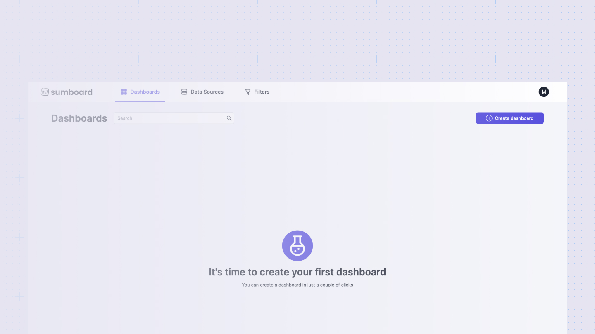
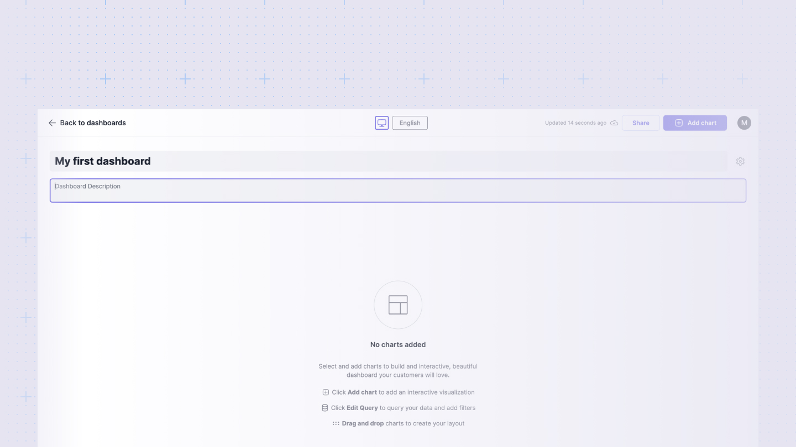

# Create your first dashboard
The Sumboard dashboard is the central hub for creating exceptional customer-facing data experiences. 

To create a new dashboard simply click the **Create dashboard** button from your workspace Home.

## Name your dashboard
Give your dashboard a descriptive title and description. You can always change this later.
