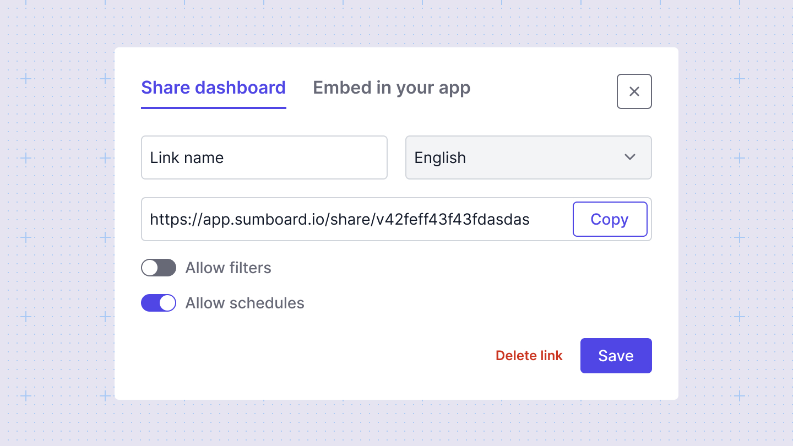
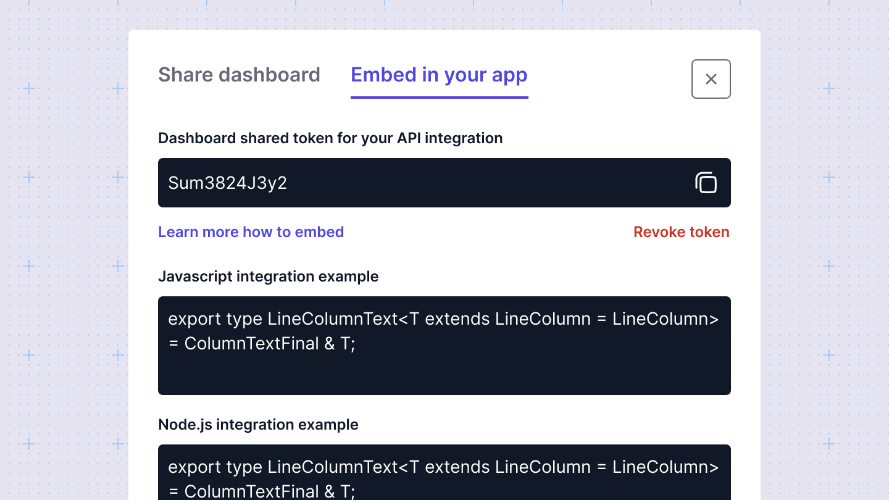

# Share or embed
Sumboard makes it easy to share a dashboard or embed it into existing applications. 

## Sharing a dashboard
To share a dashboard via a link, click the Share button and add a share link. Assign a name and configure sharing properties, such as enabling filtering and scheduling. This will generate a public link that you can share with your customers or team members.

## Embedding a dashboard
To embed a dashboard, click on the Embed tab and create an embed. This will generate an embedding token, which you can use in your back-end to integrate the dashboard into your app. 

