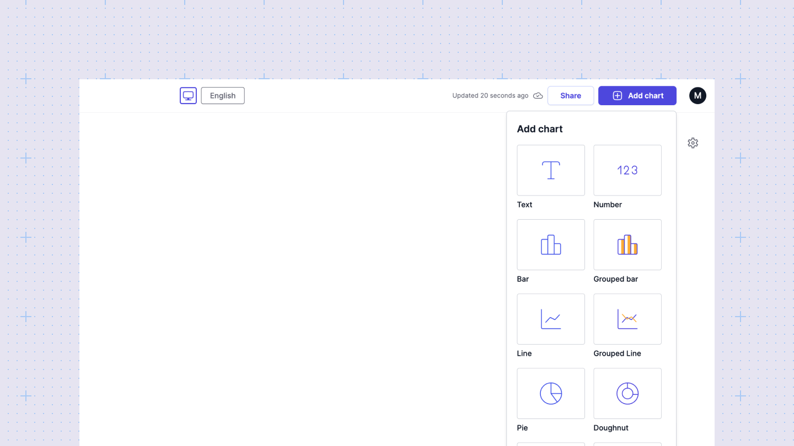
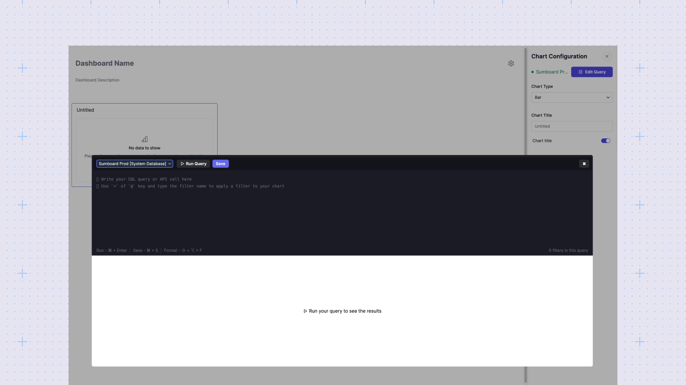
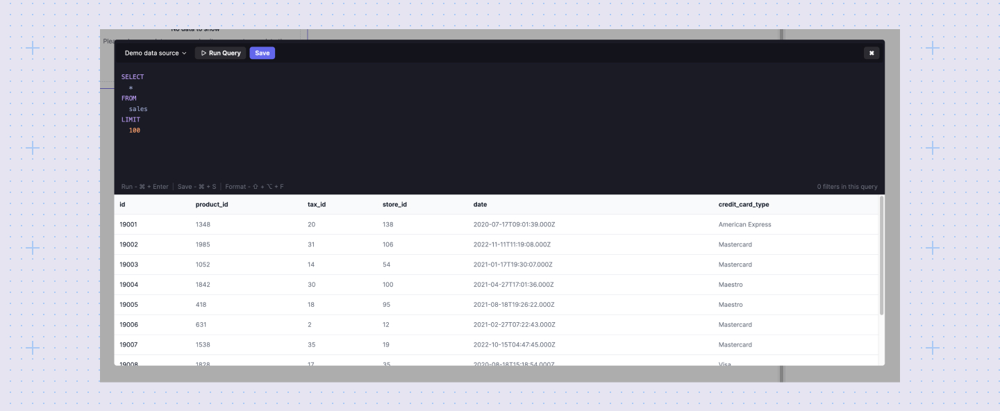
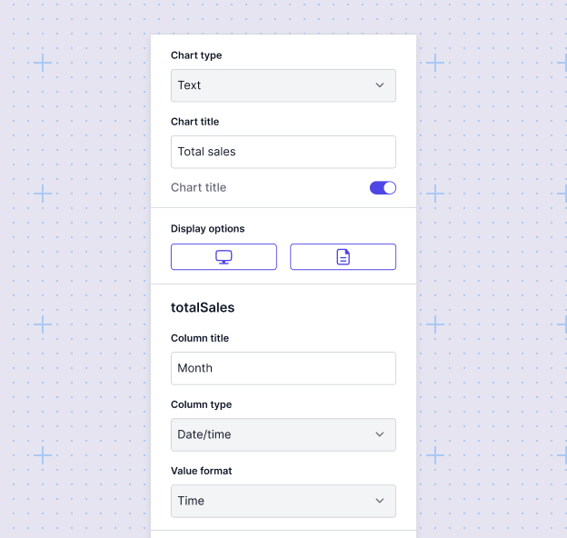

# Build your dashboard
The dashboard editor in Sumboard allows you to query and visualize your data. Once you've added a data source and created a dashboard, you're ready to start building.

## Start with a chart
In Sumboard, building a dashboard begins with selecting a chart. These charts are the building blocks of your dashboard. You can resize and drag-and-drop charts to design your dashboard as desired.

## Select a data source
To query your data, start by selecting a data source. This could be from your connected databases, APIs, or the demo data provided by Sumboard. Simply click on a chart, then click the "Edit query" button in the chart configuration sidebar. From the query editor, choose the data source you want to work with.

## Bring your data to dashboard
After selecting your data source, pull the relevant data into your dashboard. Use the query editor, which supports both SQL and API requests, to write your query. Click the Run button (`Ctrl/Cmd + Enter`) to execute the query.

 

The Results table below the query editor will display up to 10 rows of your query results. If you're satisfied with the query results, click the Save button (`Ctrl/Cmd + S`).

## Configure your visualization
Customize your chart to accurately represent your data. Adjust settings such as chart type, labels, axes, column types, and formats to enhance clarity and impact.

