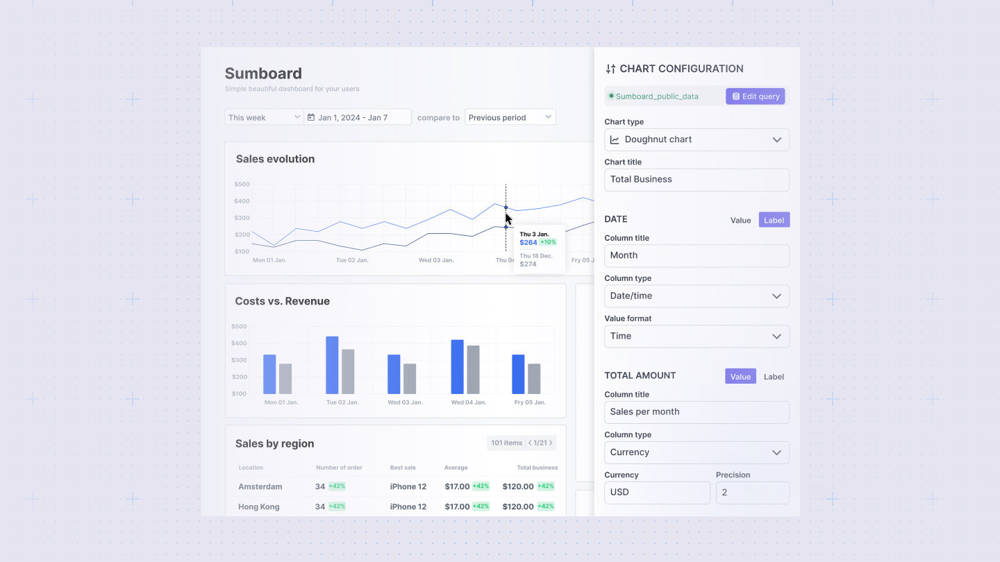

---
# https://vitepress.dev/reference/default-theme-home-page
layout: doc

hero:
  name: "Sumboard docs"
  text: "Documentation"
  image: /sumboard-logo.png
  actions:
    - theme: brand
      text: Charts examples
      link: /charts/
    - theme: alt
      text: Settings
      link: /settings/
---

# What is Sumboard

Sumboard is a low-code tool for embedding interactive analytics into B2B SaaS products. It helps developers and product teams create customizable dashboards, connect multiple data sources, and provide real-time insights to their users.

<iframe width="720" height="405" src="https://www.youtube.com/embed/oskYr81EHwA?si=qdhAj2mC8I3HcXt5" title="Sumboard - embedded analytics" frameborder="0" allow="accelerometer; autoplay; clipboard-write; encrypted-media; gyroscope; picture-in-picture; web-share" referrerpolicy="strict-origin-when-cross-origin" allowfullscreen controls=0 modestbranding=1></iframe>

## The fastes way to create Customer-facing analytics

Sumboard is the quickest way to build customer-facing analytics. Growing SaaS companies use Sumboard to:
* **Quickly set up interactive dashboards** that can be embedded in external apps. 
* **Improve slow and outdated reportings** without getting stucked in development and maintenance. 
* **Provide a better use experience** with features like filtering, comparison, email schedules and exports.

# How is Sumboard different

Sumboard stands out by offering a simple and straightforward approach to embedding customer-facing analytics. Unlike other solutions that can be complex and time-consuming, Sumboard allows you to:
* **Connect data sources**: Seamlessly integrate with various SQL or API data sources.
* **Query data**: Use an intuitive query editor to retrieve the necessary data.
* **Build visualizations**: Create interactive dashboards and visualizations with an easy drag-and-drop interface.
* **Embed dashboards**: Quickly embed the final dashboards into your product, providing immediate value to your users.

Sumboard eliminates the need for extensive development and maintenance, allowing your team to focus on core product while still delivering high-quality analytics to your customers.
