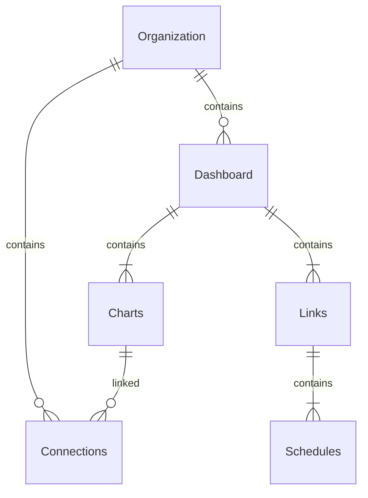

---
# https://vitepress.dev/reference/default-theme-home-page
layout: doc

hero:
  name: "Docs"
  text: "Documentation"
  actions:
    - theme: brand
      text: Charts examples
      link: /charts/
    - theme: alt
      text: Settings
      link: /settings/

features:
  - title: Charts
    details: Charts documentation
    link: /charts/
  - title: Dashboards
    details: Dashboards documentation
    link: /dashboards/
  - title: Filters
    details: Filters documentation
    link: /filters/
  - title: Data sources
    details: Data sources documentation
    link: /data-sources/
  - title: Schedules
    details: Schedules documentation
    link: /schedules/
  - title: Settings
    details: Settings documentation
    link: /settings/
---

Sumboard is a web analytics platform that enables users to create and customize dashboards from their data sources such as sql and http APIs.

> Simplified app structure

