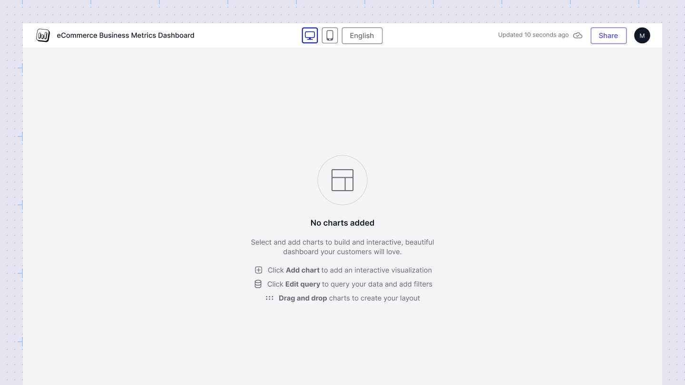

# Desktop layout
The desktop layout in Sumboard provides users with the ability to create and manage the arrangement of charts specifically tailored for desktop viewing. It's also the default layout in the shared and embbeded view.

For the desktop layout, it's important to note that the layout represents an infinite canvas with limited width but unlimited height. Editors can freely add charts as needed, scrolling vertically to accommodate additional content.

