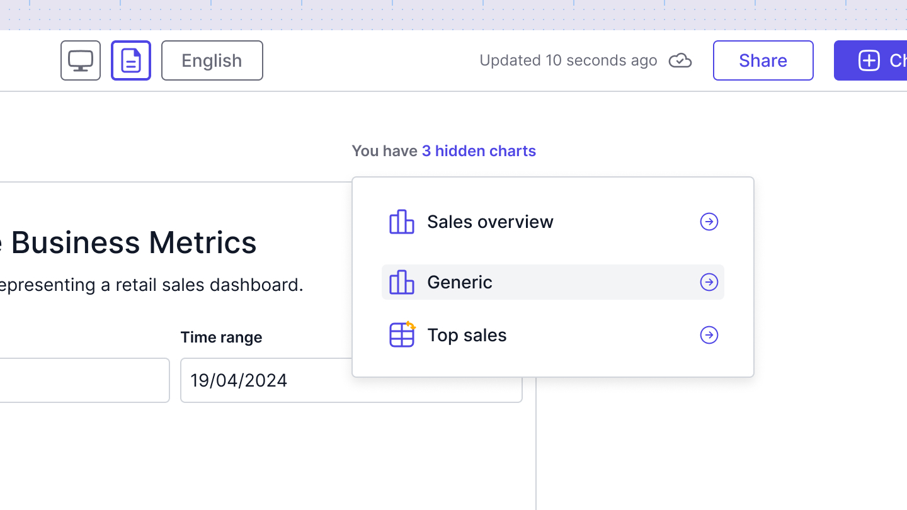

# Introduction
Sumboard allows to customize the appearance and format of your dashboards to suit different devices and use cases. Whether you're viewing your dashboard on a desktop computer, exporting it to PDF, or accessing it on a mobile device, Sumboard provides flexible layout options to ensure an optimized user experience.

With layouts, you can customize the size, position, and visibility options of the charts.

By default, all layouts have the following behaviors:
* All layouts are synchronized by default, meaning that any changes made to a chart on one layout will automatically apply to the others.
* Hiding a chart affects only the specific layout where it's hidden. Hidden charts are accessible in the **Hidden charts** menu, where you can unhide them as needed.
* Adding a new chart or unhiding a previously hidden chart automatically appends it to the end of all layouts, maintaining consistency across the dashboard.

