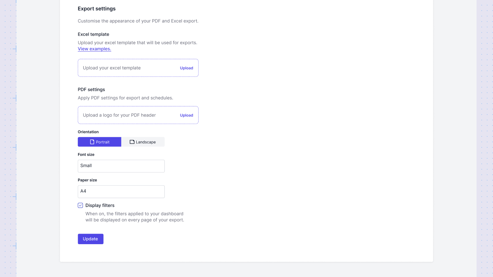
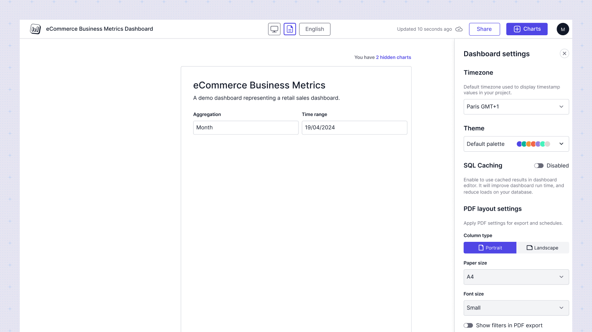

# PDF layout
The PDF layout feature in Sumboard empowers users to create and manage the layout of charts specifically tailored for PDF export.

By default the PDF layout will have the properties set up on the workspace level:

The editor has the ability to modify the page size, font size, and orientation of the layout either from the Workspace settings or Dashboard settings, overriding the settings from the workspace. 

Charts are positioned on the PDF based on a layout initially defined on the Desktop version, with the layout dynamically adjusting chart placement based on page size, font size, and orientation. If a chart exceeds the available space on a page, a new page is automatically created.

