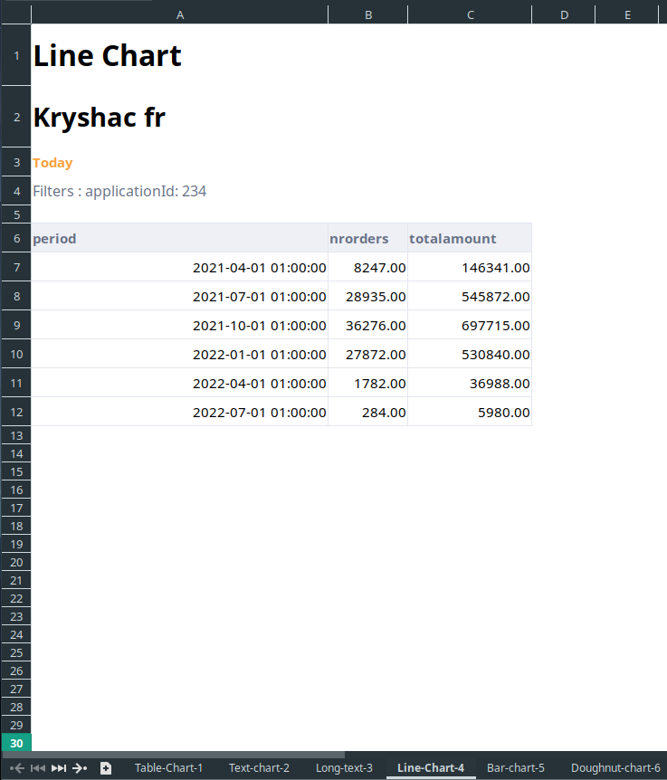
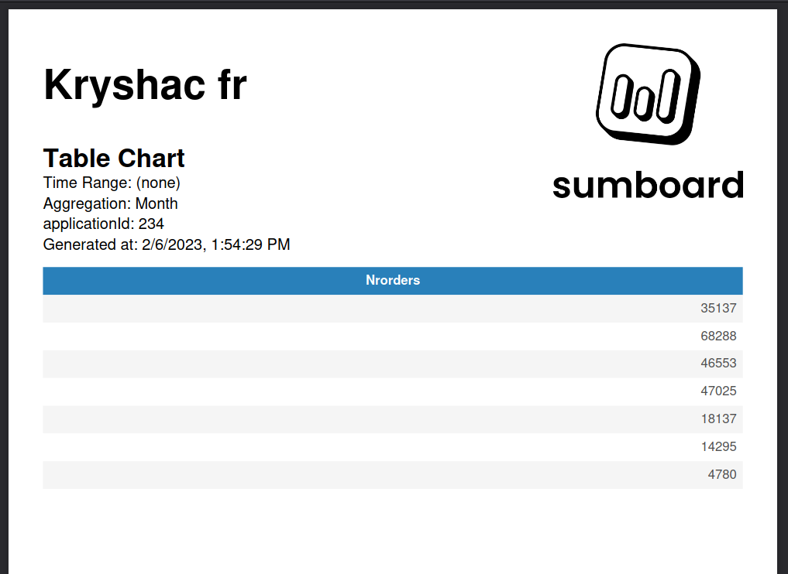
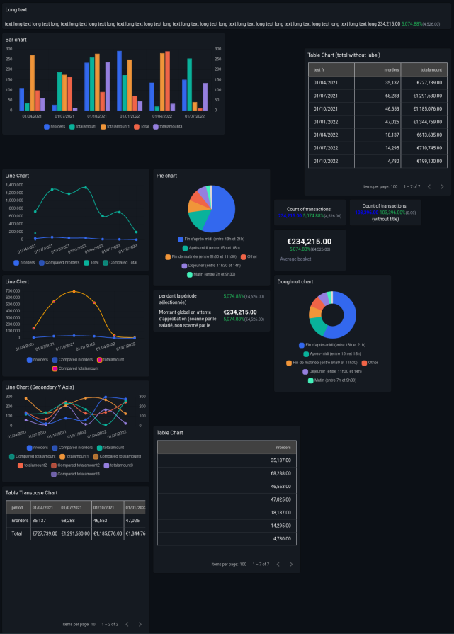

# Reports

Reports are generated documents that can be generated and downloaded from dashboard or send via emails with [schedules](/schedules/).

> There are 3 types of reports
* Excel
* Pdf
* Image
* CSV

Excel and images can be generated from a chart or dashboard. Pdf are restricted to dashboard, csv to charts only.

#### Excel

When creating excel report from dashboard, for every chart will be generated an worksheet with respective name. Filename will be dashboard name and generation time. By default it will have no image, will show the list of filters and generation date.

#### Pdf
By default it will show dashboard name and sumboard logo only on the first page. Chart name, applied filters and generation date on each page. 

#### Image

In case of image, it will take a screenshot of the entire dashboard or an individual chart.

> Pdf and excel can be configured to look corresponding with user's needs, [read more](/settings/).